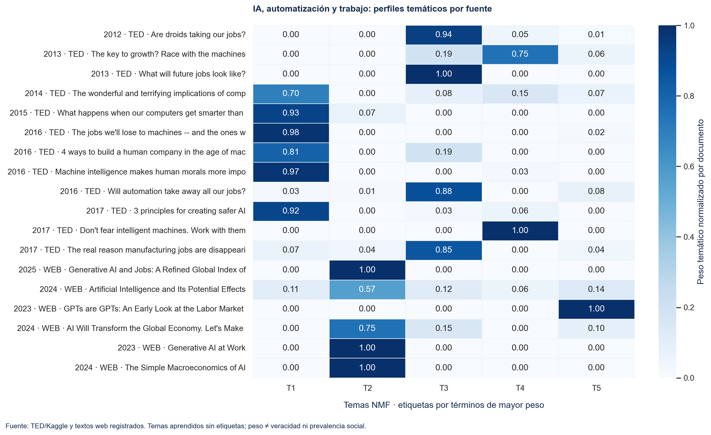
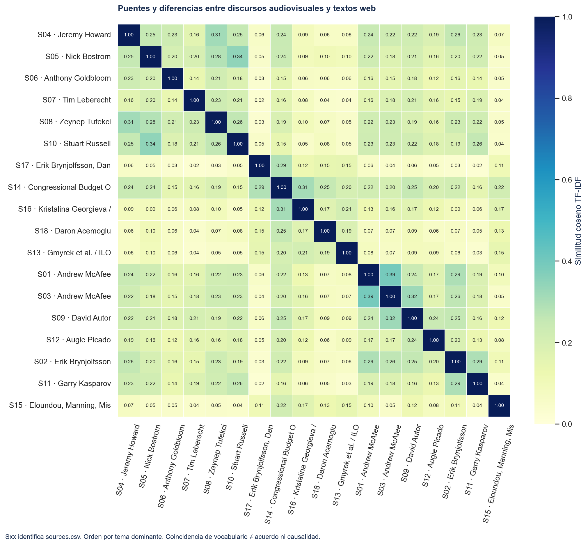
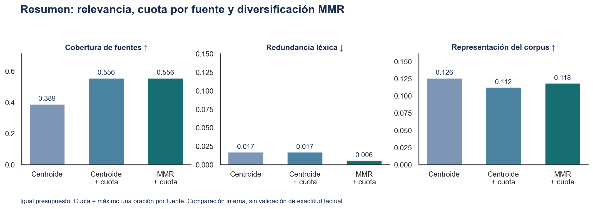
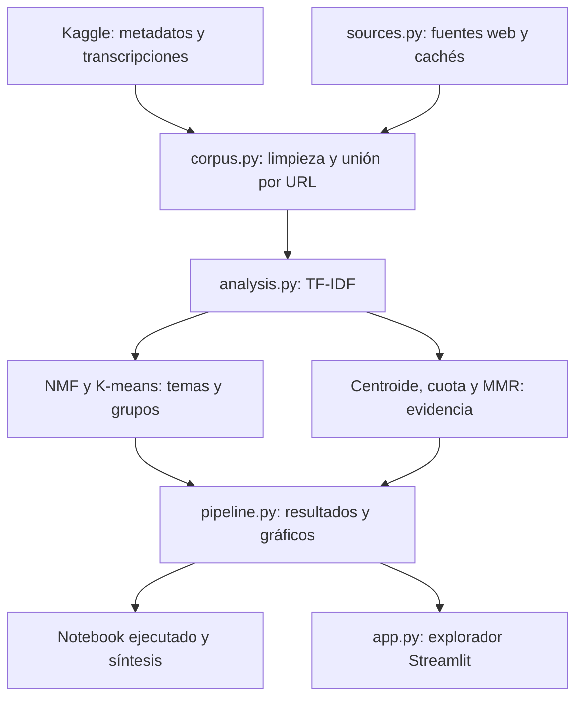

# IA, automatización y trabajo: investigación multimodal reproducible

**Autor: Diego Fernández · Proyecto 2 — TFM Máster en Data Science.**

Proyecto complementario: [Proyecto 1 — predicción de suscripción bancaria](https://github.com/diego1615/tfm-bank-marketing). [Matriz de cumplimiento de la consigna](docs/COMPLIANCE.md).

Este proyecto investiga cómo se relacionan inteligencia artificial, automatización, productividad y empleo. Combina transcripciones de vídeos TED disponibles en Kaggle con textos de organismos económicos y trabajos de investigación obtenidos de la web. Limpia y unifica las dos modalidades en texto, identifica temas mediante aprendizaje automático y construye una síntesis global trazable. La selección de fuentes es deliberada: ofrece perspectivas contrastantes y no pretende representar toda la investigación ni predecir desempleo.

**El resultado principal es [el resumen global con evidencias](outputs/resumen_global.md).** El [notebook ejecutado](notebooks/investigacion_multimodal.ipynb) permite revisar corpus, modelos, visualizaciones y comparación de enfoques. La [matriz de cumplimiento](docs/COMPLIANCE.md) vincula los entregables con la consigna.

## De la pregunta a los datos

El debate suele confundir capacidad técnica, exposición de tareas, adopción y pérdida de puestos. Para separar estas dimensiones, se seleccionan charlas de Autor, Brynjolfsson, McAfee, Goldbloom y otros ponentes relacionados con tecnología y trabajo; se complementan con fuentes de OIT, FMI, CBO y literatura científica. El corpus está en inglés para evitar que el idioma determine los grupos; la síntesis interpretativa se presenta en español.

La fuente Kaggle es [`rounakbanik/ted-talks`](https://www.kaggle.com/datasets/rounakbanik/ted-talks). El dataset contiene **2.550 registros de metadatos y 2.467 filas de transcripción**. La descarga proviene de Kaggle y no de datos simulados. Se unen `ted_main.csv` y `transcripts.csv` por URL normalizada, con validación uno a uno. Un problema real fue encontrar **tres filas de transcripción repetidas exactamente**: se eliminan duplicados idénticos, se registra el cambio y se rechazan contenidos conflictivos asociados a una misma URL.

Las fuentes escritas y su alcance se definen en [`sources.py`](src/ai_economy/sources.py). El scraper guarda HTML, valida contenido mínimo y elimina navegación; cada fuente registra URL, método de adquisición, fecha cuando está disponible y SHA-256 del texto procesado. Los fallos quedan en `run_manifest.json`; nunca se reemplazan con contenido inventado. La ejecución de ejemplo integra **12 transcripciones TED y 6 fuentes escritas**: cuatro páginas verificadas mediante un lector web y dos abstracts NBER extraídos de HTML real guardado. El lector produce texto, puede ser parcial y **no equivale a una captura HTML original**. Las dos extracciones HTML y las cuatro lecturas web quedan diferenciadas en la auditoría. Los resultados cambian si se amplía el corpus.

La modalidad audiovisual se aborda recuperando transcripciones de vídeos TED. Esto cumple el análisis del contenido hablado: **no se ejecutó ASR ni se analizaron imagen, voz o prosodia**. Se incluye una ruta opcional `transcribe.py` con `yt-dlp` y Faster Whisper para audio de vídeos de acceso autorizado; esa ruta no forma parte de los resultados publicados.

## Limpieza y unificación

`corpus.py` normaliza URLs, valida las claves, elimina marcas como aplausos o risas, extrae texto de HTML y regulariza espacios. Conserva negaciones, cifras y puntuación, porque eliminarlas dañaría el significado de afirmaciones económicas. Cada documento se convierte al mismo esquema: ID, título, autor, año, modalidad, idioma, URL, alcance, adquisición y texto. La segmentación genera IDs estables de oración que permiten reconstruir una selección concreta desde el corpus local. Se deduplican oraciones exactas antes de resumir.

La ventaja de las transcripciones preexistentes es su calidad y trazabilidad sin coste de reconocimiento de voz; sus límites son cobertura, antigüedad y pérdida de señales audiovisuales. El scraping permite incorporar informes actuales, pero cambia con la estructura de las páginas y puede enfrentar restricciones de acceso. Los abstracts son más breves que las transcripciones y no contienen todo el razonamiento del paper. Estas diferencias se conservan en los metadatos y se consideran al interpretar resultados.

La limpieza encontró marcas de interfaz del lector (`[Input]`, `[Button]`), que contaminaban los términos aprendidos. Se eliminaron esas marcas y los menús mediante delimitadores específicos de cada fuente, conservando palabras económicas legítimas como *input*. La selección inicial por ponente incorporaba tres charlas de filosofía general, marca y organización política: se excluyeron explícitamente por URL para mantener el foco en IA y trabajo, y se registra esa decisión.

## Modelos y resumen global

El análisis utiliza **TF-IDF de unigramas y bigramas**, **NMF de cinco temas** y **K-means** con semilla fija. Los pesos NMF se normalizan dentro de cada documento para que una fuente larga no domine el mapa de calor. Los términos de mayor peso etiquetan los temas; la etiqueta es descriptiva y no una categoría supervisada. El clustering y la similitud son exploratorios: coincidencia léxica no implica acuerdo, causalidad ni veracidad.

Además de las palabras vacías inglesas se excluye una lista explícita y registrada de muletillas orales (por ejemplo *going*, *just*, *actually*). Esa decisión busca que el estilo de charla no sustituya al tema; puede eliminar usos sustantivos de algunas palabras y permanece auditable en `topics.json`.

Se prueban tres selecciones con el mismo presupuesto de oraciones:

1. **Centroide**: prioriza relevancia respecto de un centroide que asigna el mismo peso a cada fuente.
2. **Centroide con cuota**: conserva esa relevancia y añade un máximo de una oración por fuente.
3. **MMR con cuota**: combina relevancia y penalización de redundancia, con la misma cuota; `λ=0,65`, más sensibilidad para `0,50` y `0,80`.

El control con cuota distingue el efecto de cubrir más fuentes del efecto de penalizar similitud. Se comparan cobertura, redundancia, representación léxica equilibrada por fuente y compresión. **No existe resumen de referencia ni etiquetas humanas: no se presentan ROUGE, F1 o exactitud factual.** Los diagnósticos internos no validan por sí mismos la calidad de la síntesis.

La selección extractiva local aporta evidencia; [`resumen_global.md`](outputs/resumen_global.md) ofrece una **narrativa original revisada en español**, relacionando perspectivas y limitaciones con IDs de fuente. Se distingue esa interpretación de los extractos automáticos. Los artefactos públicos contienen sólo una cita de hasta 14 palabras por fuente seleccionada, metadatos, IDs y resultados agregados. El resumen extractivo completo puede regenerarse localmente en una carpeta excluida de Git.

No se necesita una API comercial ni se afirma haber ejecutado un LLM externo. Una ventaja es poder reproducir los modelos sin credenciales; la limitación es que TF-IDF y MMR no resuelven paráfrasis complejas ni validación factual. Incorporar embeddings o un LLM requeriría comparar sus resultados con una evaluación humana y conservar las citas.

## Qué muestran las visualizaciones

La ejecución reúne **18 fuentes, 33.499 palabras y 1.202 oraciones candidatas**. Los cinco temas de la figura se interpretan mediante su vocabulario principal:

| Tema | Términos de mayor peso |
|---|---|
| T1 | humans, machine, human, machines, intelligence, learning |
| T2 | ai, workers, generative ai, task, exposure, effects |
| T3 | great, economy, work, time, jobs, look |
| T4 | chess, deep blue, played, champion, grandmaster, deep |
| T5 | powered, capabilities, models, significantly, impacts, software |



El primer gráfico permite ver qué temas comparte cada transcripción con los textos escritos y qué fuentes aportan vocabulario propio. Muestra pesos relativos por documento, no frecuencia de opinión en la población. El detalle e interpretación se incluyen en el notebook y la síntesis.

En esta ejecución, la OIT y los dos abstracts NBER concentran su peso en T2, asociado a exposición, trabajadores y productividad. Las charlas sobre IA y capacidades se aproximan a T1, mientras T4 destaca el vocabulario específico de ajedrez y competición. Estos patrones revelan estructura temática y diferencias de género discursivo; no validan una teoría sobre empleo.



El segundo gráfico identifica puentes léxicos y diferencias entre las dos modalidades. Los IDs `Sxx` se resuelven en `outputs/sources.csv`. Un abstract corto puede tener menor similitud que un discurso largo por el género textual: no debe interpretarse automáticamente como desacuerdo.

El vínculo de mayor similitud entre modalidades une la charla de David Autor y el informe de la CBO, con coseno **0,252**. Ofrece una pareja concreta para contrastar argumentos sobre tareas y empleo, sin suponer que sus conclusiones coincidan.



La tercera visualización permite evaluar el compromiso entre relevancia, diversidad y representación. Incluye el control de cuota y evita atribuir toda la mejora de cobertura a la fórmula MMR.

Centroide con cuota y MMR cubren ambos **55,6 % de las fuentes**; MMR reduce la redundancia de **0,01693 a 0,00587**, con relevancia media algo menor. El centroide sin cuota cubre 38,9 %. El resultado respalda una selección más diversa según métricas léxicas, sin demostrar superioridad factual.

## Reproducir

Desde la raíz del proyecto, con Python 3.10 o superior:

```bash
python -m venv .venv
source .venv/bin/activate
pip install -e '.[dev,app]'
python -m ai_economy.pipeline --data-dir data/raw --output outputs
pytest -q
streamlit run app.py
```

El pipeline intenta descargar el dataset público mediante la API de Kaggle y adquirir las páginas web registradas. Si Kaggle exige autenticación o bloquea esa URL, descargue el ZIP de su página y coloque **`ted_main.csv` y `transcripts.csv` en `data/raw/`**, o utilice el CLI oficial:

```bash
kaggle datasets download -d rounakbanik/ted-talks -p data/raw --unzip
```

La caché web se guarda en `data/raw/web/`. Una ejecución posterior con datos ya adquiridos puede realizarse sin red:

```bash
python -m ai_economy.pipeline --data-dir data/raw --output outputs --offline
python -m ai_economy.export_summary --output outputs --method mmr
python scripts/create_notebook.py
jupyter nbconvert --execute --to notebook --inplace notebooks/investigacion_multimodal.ipynb
```

El notebook puede abrirse sin datos crudos para auditar los resultados publicados; indica explícitamente ese modo y no lo presenta como una nueva ejecución de los modelos. Con los datos en `data/raw`, vuelve a ejecutar el pipeline. El manifiesto del ejemplo conserva versiones de paquetes, semilla, hashes, auditoría de unión y adquisición, y fallos de fuentes.

El notebook entregado se ejecutó completo mediante IPython en proceso y conserva tablas y figuras reales. Si no se permite iniciar un kernel TCP, puede usarse `python scripts/execute_notebook.py`; su método queda registrado en los metadatos del notebook y genera una vista HTML autosuficiente.

Para la ruta opcional de audio, con `ffmpeg` instalado y acceso permitido al vídeo:

```bash
pip install -e '.[audio]'
python -m ai_economy.transcribe 'https://www.youtube.com/watch?v=ID_REAL' --destination data/raw/audio --language en
```

El comando produce segmentos temporales y texto ASR local. Su salida no se mezcla automáticamente con el corpus TED: se debe revisar calidad, metadatos e idioma antes de ampliar la investigación. El ejemplo `ID_REAL` es un marcador para una URL elegida, no un vídeo afirmado como analizado.

## Módulos y flujo completo



`export_summary.py` reconstruye el resumen completo local; `transcribe.py` es una extensión opcional no ejecutada. `tests/` comprueba limpieza, unión, adquisición y trazabilidad de la selección. La revisión [de cumplimiento](docs/COMPLIANCE.md) identifica cada entregable de la consigna.

## Límites y siguientes mejoras

La capa TED termina en 2017 y las fuentes escritas son posteriores. Esa comparación temporal permite contextualizar argumentos, pero **no identifica una evolución causal**. El corpus es pequeño, deliberado y homogéneo en idioma. NMF depende del número de temas; K-means no sustituye una taxonomía validada. Las oraciones extraídas pueden necesitar contexto y la narrativa interpretativa requiere revisión humana.

La siguiente mejora prioritaria sería construir una rúbrica y resúmenes humanos de referencia para evaluar cobertura factual, contradicciones y legibilidad. Después se ampliaría el corpus con charlas contemporáneas, se contrastarían embeddings con TF-IDF y se incorporarían marcas temporales del audio para auditar ASR. Los fallos de adquisición deben seguir visibles y no convertirse en datos sintéticos.

## Uso de datos y licencia

La licencia del código se encuentra en `LICENSE`; no licencia contenido de TED, Kaggle ni de los autores de artículos. **Los textos íntegros, HTML, audio y vídeos no se redistribuyen** en el repositorio. Se proporcionan enlaces, scripts de adquisición y hashes para facilitar reproducción y atribución. Consulte los términos actuales de cada fuente antes de reutilizar sus contenidos. Más detalle en [DATA_SOURCES.md](docs/DATA_SOURCES.md).
